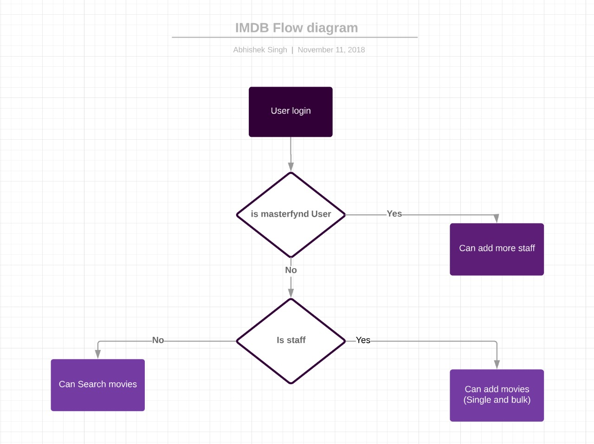
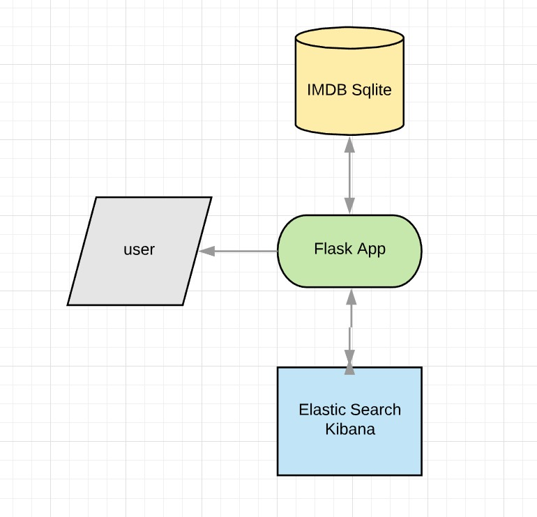

# IMDB SEARCH


## API
 
 - ### Public Api

    #### /register
    ```sh
        - POST
            Payload
            {
                 "name":"master",
                 "password":'masterpassword",
                 "email":"master@fynd.com",
                 "username":"masterfynd"
            }        
    ```
    #### /login
    ```sh
        - POST
            payload 
            {
	                "username":"master",
	                "password":"masterpassword"
            }
      ```
        
    #### /search
    ```sh
    search on database
        - POST
            payload
            {
                "search":"value"
            }
    ```
    #### /search_es
    ```sh
    match search on elastic serch
        - POST
            payload
            {
                "search":"value"
            }
    ```    
    
    #### /add_admin (only available for super user)
    ```sh
    give add and delete rights to users
        - POST
            payload
            {
                 "name":"master",
                 "password":'masterpassword",
                 "email":"master@fynd.com",
                 "username":"masterfynd"
            }
    ```
    #### /dashboard 
    ```sh
       - GET
            Shows the result of search 
    ```
    #### /add_movies
    ```sh
     Adds a new entery to database and elasticsearch
        - POST
            payload
            {
                "popularity": "popularity",
                "director": "director",
                "genre":  "genre",
                "imdb_score": "imdb_score",
                "name": "name"
            }

    ```
    #### /bulkadd
    ```sh
    Bulk add to to database and elasticsearch
    upload a json of a type 
        [
            {
                "popularity": 83.0,
                "director": "Victor Fleming",
                "genre": [
                    "Adventure",
                    " Family",
                    " Fantasy",
                    " Musical"],
                "imdb_score": 8.3,
                "name": "The Wizard of Oz"
            }
        ]
    
    ```
    #### /analytics
    ```sh
    Shows realtime analysis graphs on the data
    ```    
   
    